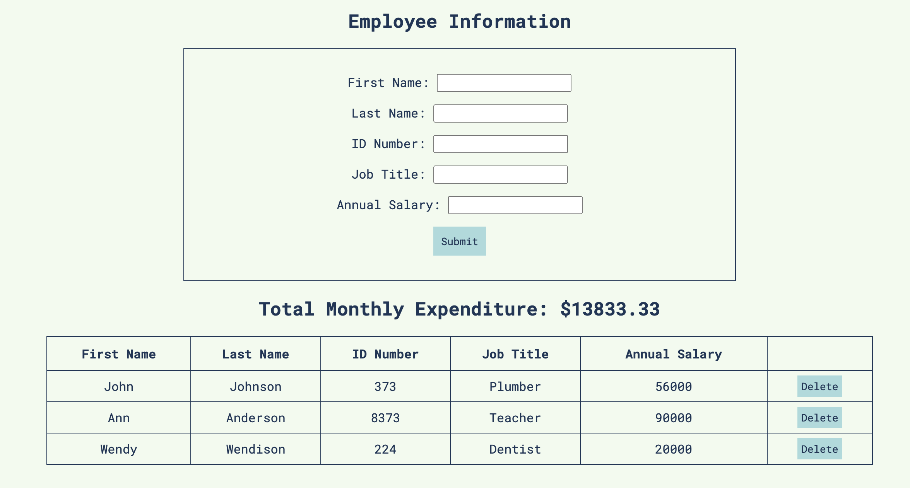
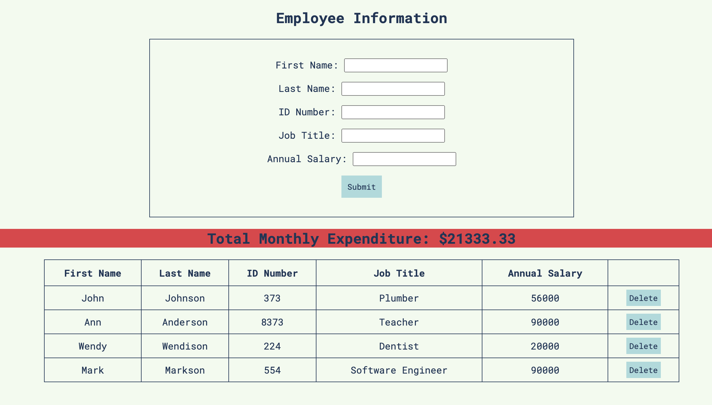

# PROJECT NAME
Employee Information & Monthly Expenses Calculator

## Description

Duration: 1.5 Week Sprint

We were asked to create a form which would take in employee information, including first and last name, ID number, position, and annual salary. This information is then stored and displayed in a table in the DOM.

We were asked to calculate total monthly expenditure. To calculate this, each employee's annual salary was divided by 12, then added together. If the total monthly expenditure was greater than $20,000, the amount is highlighed in red.

## Screen Shot

### Prerequisites

- [Node.js](https://nodejs.org/en/)
- [Express](https://expressjs.com/)

## Installation

1. Install node.js 
2. Initialize project, build out package.json file `npm init`
3. Install express `npm install express`
4. Run `npm start` in your terminal to start the server
5. Navigate to localhost:8000 in your browser to view the page

## Usage

1. Add new employees by filling out the fields in the form
2. Employee information will be added to a new row in the table
3. Monthly expenditures will be computed from annual salary and displayed
4. If monthly expenditures exceed $20,000, the box will turn red
5. Delete employee informtion by hitting the delete button in the table
6. Reload the page to reset

## Built With

- [Node.js](https://nodejs.org/en/)
- [Express](https://expressjs.com/)

## Acknowledgement
Thanks to [Prime Digital Academy](www.primeacademy.io) who equipped and helped me to make this application a reality.

## Support
If you have suggestions or issues, please email me at [mayampeters@gmail.com](mailto: mayampeters@gmail.com)
